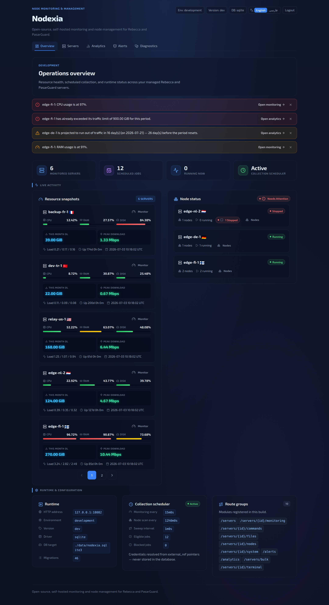
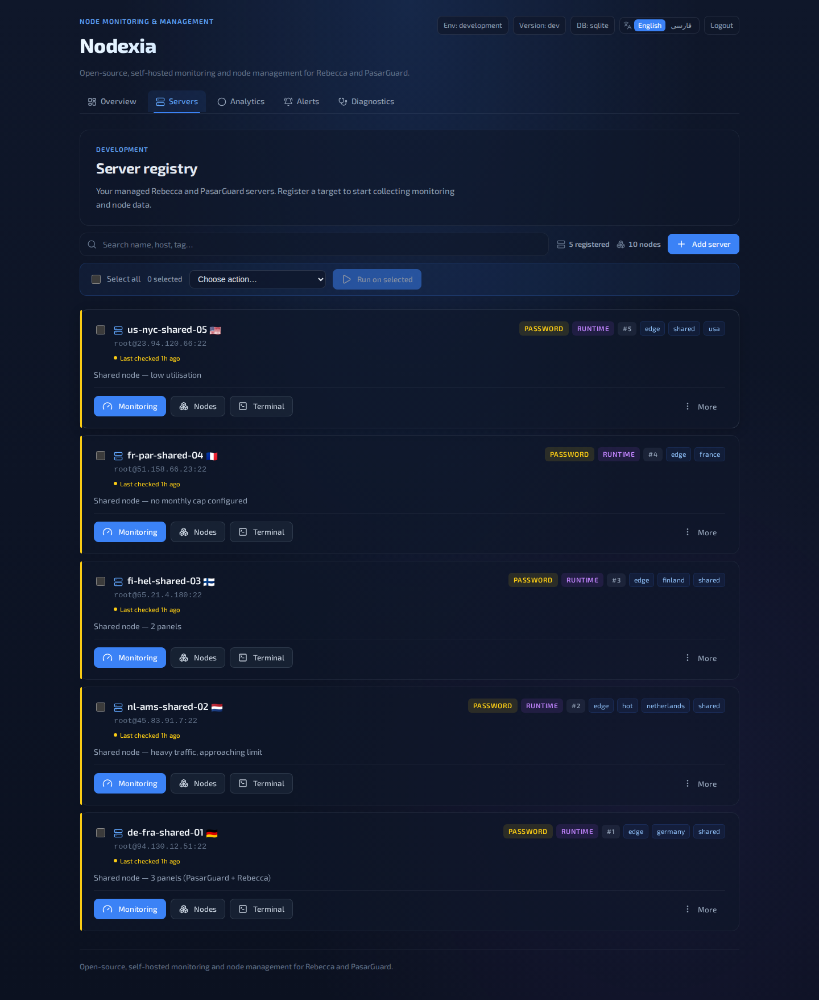
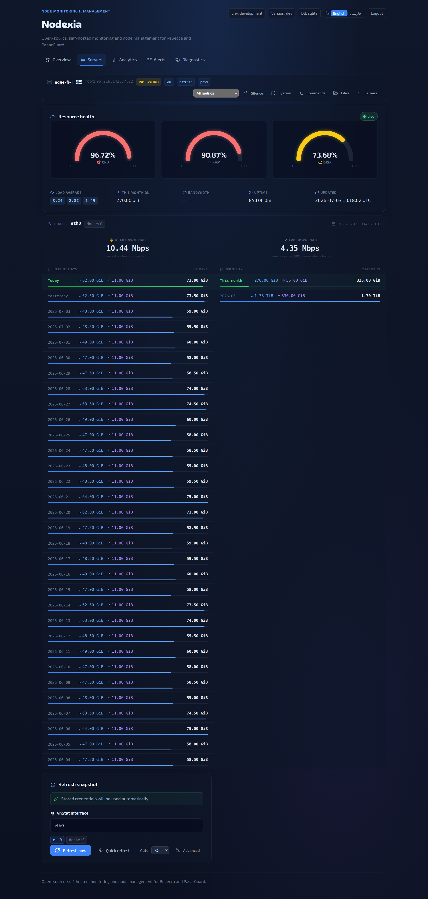
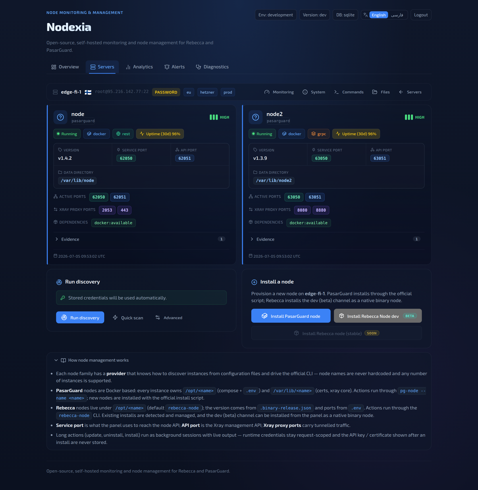
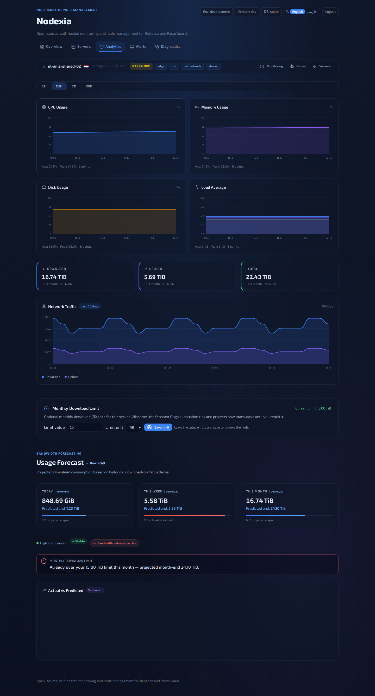
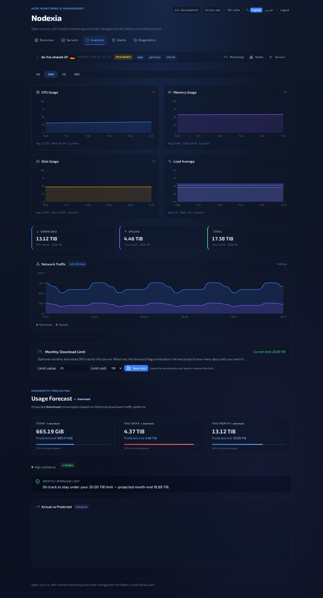
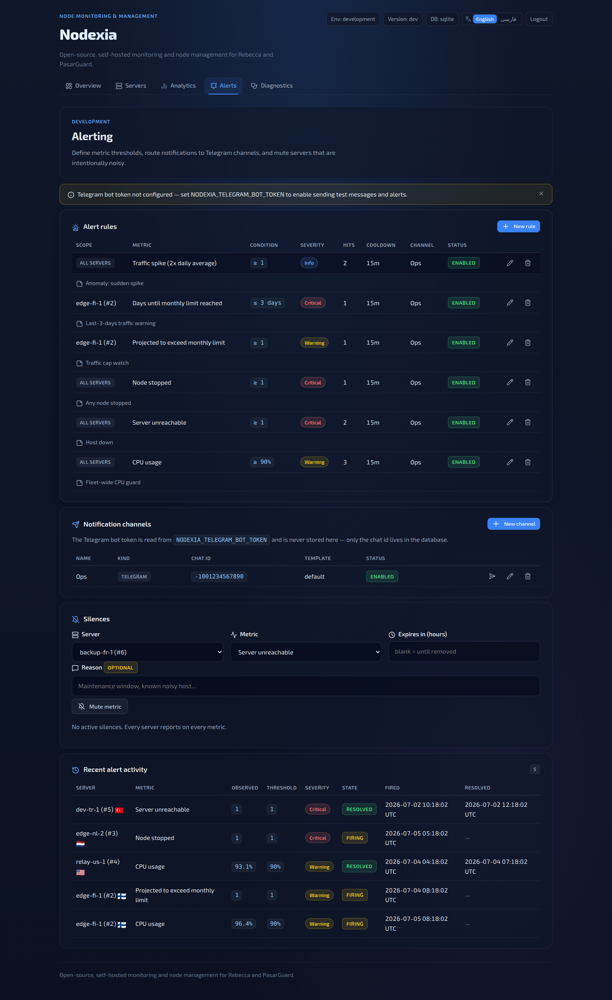
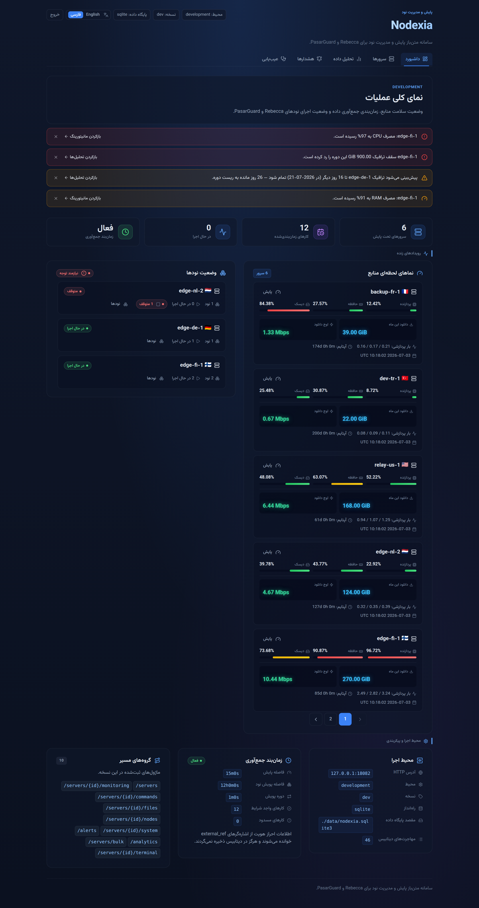

# 🛰️ Nodexia

> Lightweight, self-hosted control panel for monitoring and managing **Rebecca** and **Pasarguard** panel nodes.

  

> ⚠️ **Under active development.** Built with AI assistance — review, test, and harden before using with sensitive production data.

A single Go binary — server-rendered HTML (`html/template`), the standard-library
HTTP server, and a tiny pinned set of dependencies. It connects to your nodes
over SSH, collects resource and traffic metrics on a schedule, and surfaces them
through monitoring, analytics, forecasting, and alerting.

---

## ✨ Features

- 📊 **Monitoring & analytics** — CPU, RAM, swap, disk, load, and uptime per
  server, plus vnStat traffic (daily/monthly download & upload), charted from rollups.
- 🔮 **Bandwidth forecasting** — projects today / this-week / this-month download,
  with a confidence level; the model adapts as more history arrives.
- 🚦 **Monthly limits** — optional per-server download cap with a
  days-to-exhaustion estimate.
- 🔔 **Alerting** — threshold and **predictive** rules (warn *before* a limit is
  hit) with cooldowns, silences, history, Telegram delivery, and an optional digest.
- 🔍 **Node discovery** — detect and manage Rebecca / Pasarguard nodes, with a
  Pasarguard install wizard.
- 🌐 **Bilingual UI** — full English and Persian (فارسی) with RTL; installable as a PWA.
- 🧰 **Supporting tools** — bulk reboot/update/delete, in-browser SSH terminal,
  command runner, SFTP browser, and encrypted backup/restore.
- 🔒 **Security** — single admin, HMAC CSRF-protected sessions, login rate
  limiting, SSH host-key pinning, and runtime-only SSH credentials.

---

## 🚀 Install

Nodexia runs as a Docker Compose stack behind [Caddy](https://caddyserver.com/)
(automatic HTTPS). On a fresh **Ubuntu 24.04** host with root/sudo, a domain
`A` record pointing at it, and inbound TCP **80**/**443** open:

```bash
git clone https://github.com/Ho3einK84/Nodexia.git
cd Nodexia
sudo ./install.sh --domain panel.example.com --email you@example.com
```

`install.sh` installs Docker, deploys to `/opt/nodexia`, generates secrets,
registers the `nodexia.service` systemd unit, installs the `nodexia` CLI, and
waits for health. It downloads a prebuilt, SHA-256-verified binary for a
sub-second build (falling back to compiling from source). Add `--non-interactive`
for an unattended run (a random admin password is printed once at the end).

| Flag | Purpose |
|------|---------|
| `--domain <host>` | Public hostname (required for a new install) |
| `--email <addr>` | ACME / Let's Encrypt contact |
| `--admin-user` / `--admin-password` | Admin login (preserved on rerun unless set) |
| `--telegram-bot-token <token>` | Enable Telegram alert delivery |
| `--image-version <tag>` | Release to deploy — a tag (e.g. `v0.2.0`) or `latest` |
| `--build-from-source` | Always compile from source; skip prebuilt binaries |
| `--non-interactive` | Never prompt; auto-generate missing values |
| `-h`, `--help` | Show all options |

---

## 🧭 Managing Nodexia

The installer adds a `nodexia` command (it uses `sudo` automatically when needed):

```bash
nodexia status                            # container status
nodexia logs                              # follow logs (e.g. `nodexia logs app`)
nodexia up / down / restart               # control the stack
nodexia update                            # upgrade to the latest release, keeping secrets
nodexia update --image-version v0.2.0     # or pin a specific version
nodexia uninstall [--purge] [--yes]       # remove stack + CLI; --purge also wipes data
```

> 🛠️ **Manual / non-Ubuntu:** `cp .env.production.example .env.production`, edit
> it, then `docker compose -f compose.production.yml up -d --build`.

---

## 📸 Screenshots

> From **v0.2.0**, with demo data shown purely to illustrate the interface.

| | |
|---|---|
| **Dashboard** — health, traffic, and collection status.<br> | **Server registry** — shared hosts with country, tags, actions.<br> |
| **Monitoring** — live CPU / RAM / disk gauges, load, uptime.<br> | **Node discovery** — detected nodes per host.<br> |
| **Forecast — exceeding limit**.<br> | **Forecast — within limit**.<br> |
| **Alerting** — threshold + predictive rules.<br> | **Persian (فارسی)** — full RTL layout.<br> |

---

## ⚙️ Configuration

Environment-based — the full annotated list lives in
[`.env.production.example`](.env.production.example). Edit
`/opt/nodexia/.env.production` and run `nodexia restart` to apply.

| Variable | Required | Description |
|----------|:--------:|-------------|
| `NODEXIA_AUTH_USERNAME` / `NODEXIA_AUTH_PASSWORD` | ✅ | Admin login; weak/empty passwords are refused in production. |
| `NODEXIA_SESSION_SECRET` | ✅ | HMAC key for signed cookies; unique, ≥ 16 chars (`openssl rand -base64 48`). |
| `NODEXIA_DOMAIN` | ✅ | Public hostname; changing it re-issues certificates on restart. |
| `NODEXIA_TELEGRAM_BOT_TOKEN` | — | Telegram bot token for alerts/digest; blank disables sending. |
| `NODEXIA_DB_DRIVER` / `NODEXIA_DB_DSN` | — | `sqlite` (default) or `mysql` + DSN. |
| `NODEXIA_SSH_HOST_KEY_POLICY` | — | `tofu` (default) or `insecure`. |

> 🔐 **Never commit or share `.env.production`** — it holds your admin password,
> session secret, and bot token. It's gitignored.

**Telegram alerts.** Create a bot with [@BotFather](https://t.me/BotFather), set
`NODEXIA_TELEGRAM_BOT_TOKEN`, restart, then add a channel and rules under
`/alerts`. Predictive metrics (`projected_exceed_limit`, `days_to_exhaustion`)
require a monthly limit set on the server's analytics page.

---

## 💻 Local development

```bash
cp .env.example .env          # set NODEXIA_AUTH_USERNAME / NODEXIA_AUTH_PASSWORD
go run ./cmd/nodexia/
```

Open <http://localhost:8080> and sign in (dev cookies aren't `Secure`, so plain
HTTP works).

---

## 🧪 Build, test & release

```bash
make build    # → bin/nodexia
make test     # full test suite
go vet ./...  # static analysis
```

Pushing a version tag (`git tag v0.2.0 && git push origin v0.2.0`) triggers
[`release.yml`](.github/workflows/release.yml): it runs the tests, cross-compiles
static `linux/amd64` + `linux/arm64` binaries, and publishes them (with
`checksums.txt`) to a GitHub Release. The project targets the latest **Go 1.25.x**.

---

## 📄 License

MIT
